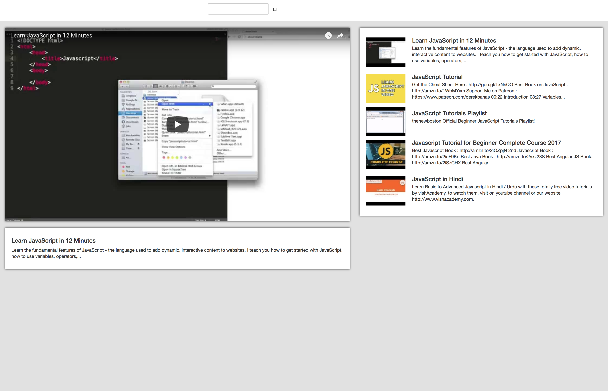

# youtube-react-redux
Clone of Youtube using ReactJS, Redux, Redux-Thunk, React-Router, ES06, Webpack, Sass.

To install dependencies just do 
After cloning,

$ cd youtube-react-redux

$ npm install

and start local development server (available at https://localhost:8080/):

$ npm run dev

<h2>Preview of App</h2>

